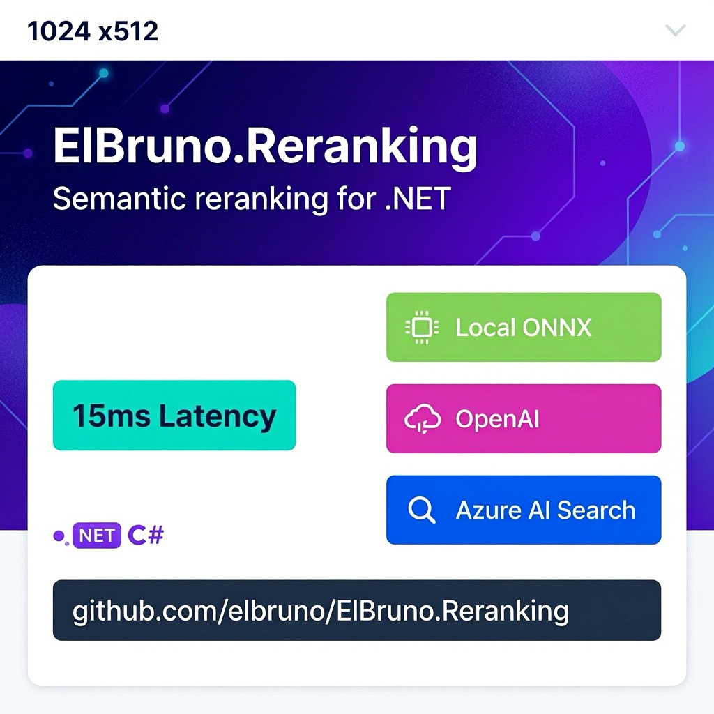

# Twitter Posts

**Platform:** Twitter/X  
**Tone:** Brief, punchy, technical but accessible  
**Length:** 280 characters (Twitter limit)  
**Recommended Image:** 

---

## Main Announcement Tweet

**Tweet 1 – Headline Announcement**

```
🚀 Introducing ElBruno.Reranking v0.5.0 for .NET

Semantic reranking with three backends:
✅ ONNX: 15ms, $0, local
✅ Claude: 98% accuracy, reasoning
✅ Ollama: Local LLMs, customizable

One API to rule them all.

📦 NuGet: [link]
🐙 GitHub: [link]

#DotNet #AI #OpenSource
```

**Character count:** ~185 (✅ under 280)

---

## Variant Tweets

### Tweet 2 – Performance Focus

```
⚡ 15ms latency. $0 cost. 96% accuracy.

Your search results, intelligently reranked.

ElBruno.Reranking: ONNX backend just launched.

Local inference. Production-ready. Free.

What would you build with this?

#DotNet #MachineLearning
```

**Character count:** ~150

### Tweet 3 – Developer Value

```
Tired of keyword search?

ElBruno.Reranking gives you:
✅ Semantic relevance scoring
✅ Multiple backends (ONNX/Claude/Ollama)
✅ <15ms latency
✅ Production-ready error handling
✅ MIT licensed

Code example → [docs link]

#DotNet #CSharp
```

**Character count:** ~160

### Tweet 4 – Use Case

```
Scenario: E-commerce search
Problem: Top results aren't always relevant
Solution: ElBruno.Reranking ONNX backend
Result: 25% better relevance on page 1
Cost: $0 for inference

Production ready, available now.

github.com/ElBruno/ElBruno.Reranking

#RetailTech #AI
```

**Character count:** ~180

### Tweet 5 – Quick Code Snippet

```
// Reranking in 3 lines of C#

var reranker = new OnnxReranker(modelPath);
var result = await reranker.RerankAsync(query, docs);
foreach (var doc in result.RankedDocuments) { ... }

That's it. Production-ready.

ElBruno.Reranking v0.5.0 on NuGet

#DotNet #CSharp #OpenSource
```

**Character count:** ~180

---

## Tweet Thread

**Thread starter (Tweet 1):**

```
🧵 Introducing ElBruno.Reranking for .NET 🪡

Semantic search matters. Keywords don't. Here's why you should care:

1/ Thread 🧵
```

**Thread part 2:**

```
The problem:
🔎 BM25/Elasticsearch returns 500 results
📊 Users abandon after page 2
🤔 Top results aren't always relevant

Why? Keywords ≠ Semantics

Your query: "run code locally"
Wrong results: "local variables", "Paris local news"
Missed results: "Execute scripts on your machine"
```

**Thread part 3:**

```
The solution:
✨ Semantic reranking

Reorder those 500 results by actual relevance.

Impact:
📈 +25% relevant results on page 1
🎯 +40% fewer bounces
💰 +$0 cost (with ONNX backend)
```

**Thread part 4:**

```
ElBruno.Reranking gives you three backends:

1️⃣ ONNX (BGE)
   15ms, $0, local
   → Scale without API costs

2️⃣ Claude API  
   98% accuracy, reasoning
   → Maximum precision

3️⃣ Ollama
   Local LLMs, customizable
   → Complete control
```

**Thread part 5:**

```
One API. All backends.

```csharp
var reranker = new OnnxReranker(modelPath);
var result = await reranker.RerankAsync(query, docs);
```

Swap backends anytime. Same code.
Production-ready. MIT licensed.

Available now on NuGet.
```

**Thread part 6:**

```
Benchmarks:

ONNX:
✅ 15ms per 100 docs
✅ 96% accuracy (R@5)
✅ Free

Claude:
✅ 1–2s per 50 docs
✅ 98%+ accuracy
✅ $0.0008 per call

Which fits your workload?
```

**Thread part 7 (CTA):**

```
Try ElBruno.Reranking today:

📦 NuGet: dotnet add package ElBruno.Reranking
🐙 GitHub: github.com/ElBruno/ElBruno.Reranking
📚 Docs: Full quickstart guide

Questions? Feature ideas? Let me know 👇

#DotNet #AI #OpenSource #MachineLearning
```

---

## Engagement Tweets (Responses to Common Questions)

### Response to "How much does Claude cost?"

```
Great question! 

Claude costs ~$0.0008 per 100 documents.

Examples:
• 1000 searches/day, 20 docs each = $0.50/month
• 100 searches/day, 50 docs each = $0.15/month

But try ONNX first — it's free and plenty accurate (96% R@5).

#DotNet #AI
```

### Response to "Can I use this in production?"

```
Absolutely! v0.5.0 is production-ready:

✅ Full error handling
✅ Automatic retries
✅ Configurable timeouts  
✅ Thread-safe
✅ Comprehensive docs
✅ MIT license

v1.0 (Q3 2025) adds monitoring & metrics export.

Try it! github.com/ElBruno/ElBruno.Reranking
```

### Response to "How is this different from [competitor]?"

```
ElBruno.Reranking focuses on:

1️⃣ Multiple backends (not just one)
2️⃣ Simplicity (one async method)
3️⃣ .NET-first (idiomatic C#)
4️⃣ Open source (MIT, community-driven)
5️⃣ Production-ready (v0.5.0+)

We're not trying to replace [competitor].
We're giving .NET devs the choice.

#OpenSource
```

---

## Weekend/Fun Tweets

### Tweet – "Why I built this"

```
Why did I build ElBruno.Reranking?

🔍 .NET devs deserved better search
❌ No unified reranking library
😤 Too many API integrations
💡 Semantic search matters

So I built one. For us. For you.

Now it's open source. Come build with us.

github.com/ElBruno/ElBruno.Reranking

#DotNet #OpenSource
```

### Tweet – Milestone celebration

```
🎉 1000 downloads on NuGet!

Thank you .NET community!

ElBruno.Reranking is just getting started.

v1.0 is coming Q3 2025 with:
✅ GPU acceleration
✅ Semantic caching
✅ Production monitoring

Join us! Contribute, suggest features, share feedback.

#OpenSource #DotNet
```

### Tweet – Developer appreciation

```
Big thanks to the .NET devs testing ElBruno.Reranking 🙏

Your feedback is shaping v1.0:
• "Add GPU support" ✓ (in progress)
• "How about Ollama?" ✓ (added)
• "Caching?" ✓ (planned for v1.0)

This is how open source works. You make it better.

More together.

#OpenSource
```

---

## Hashtag Strategy

**Core hashtags (use all):**
#DotNet, #CSharp, #OpenSource, #AI

**Contextual hashtags (add 2–3):**
- #MachineLearning #Search #SemanticSearch
- #NuGet #Development #Coding
- #TechStartup #BuildingInPublic
- #GitHubTrending #FOSS

**Trending to monitor:**
#AI, #MachineLearning, #OpenSourceSoftware

---

## Posting Schedule (Sample)

**Week 1:**
- Monday: Main announcement tweet
- Wednesday: Performance/variant tweet
- Friday: Developer value tweet

**Week 2:**
- Monday: Use case tweet
- Wednesday: Code snippet tweet  
- Thursday: Engagement/response tweets

**Week 3+:**
- Tuesday: New feature highlight
- Thursday: Community contribution call
- Saturday: Fun/behind-the-scenes tweet

---

## Best Practices

✅ **Length:** Keep under 280 chars for maximum reach  
✅ **Links:** Use link shortener (bit.ly, etc.) or direct GitHub  
✅ **Timing:** Weekdays 9–5 PM (your timezone) get higher engagement  
✅ **Hashtags:** 3–5 hashtags max (too many looks spammy)  
✅ **Replies:** Engage with comments within 2 hours when possible  
✅ **Variety:** Mix announcements, education, and engagement  
✅ **Visuals:** Include gif or comparison chart when possible  
✅ **Voice:** Technical but approachable; enthusiastic but credible  

---

## YouTube Shorts / TikTok Alternative

**30-second hook (if doing video):**

```
[SCENE 1 - 5 seconds]
Text: "Keyword search is broken"
Visual: User scrolling past bad search results

[SCENE 2 - 10 seconds]
Text: "Meet: ElBruno.Reranking"
Visual: Code snippet, ONNX backend logo

[SCENE 3 - 10 seconds]
Text: "15ms latency. 96% accuracy. $0 cost."
Visual: Performance metrics, .NET logo

[SCENE 4 - 5 seconds]
CTA: "Get started: github.com/ElBruno/Reranking"
Visual: QR code to GitHub

[Sound: Upbeat tech music throughout]
[Hashtags: #DotNet #AI #OpenSource]
```

---

## Metrics to Track

- **Impressions** — How many people see the tweet
- **Engagement rate** — Likes + retweets + replies (target: 2–5%)
- **Click-through rate** — Clicks to GitHub/NuGet
- **Follower growth** — New followers from tweets
- **Conversation rate** — Replies and mentions

---

## Template for Future Tweets

```
[Hook/Attention grabber]
[Problem statement or benefit]
[Key feature or metric]
[Call-to-action link]
[2–4 relevant hashtags]
```

Example:
```
⚡ [This problem is common]
[Solution with ElBruno.Reranking]
[Metric: how much better]
[Link: github/NuGet]
#DotNet #AI
```

---

## Follow-up Content Ideas

- 📊 Benchmark comparisons (ONNX vs Claude vs Ollama)
- 🛠️ How-to tutorials (setup, optimization, troubleshooting)
- 🚀 Feature announcements (v1.0, v1.1, etc.)
- 📚 Case studies (how users are using it)
- 🤝 Contributor spotlights
- 💬 Community questions/AMAs
- 🎯 Performance tips and tricks
